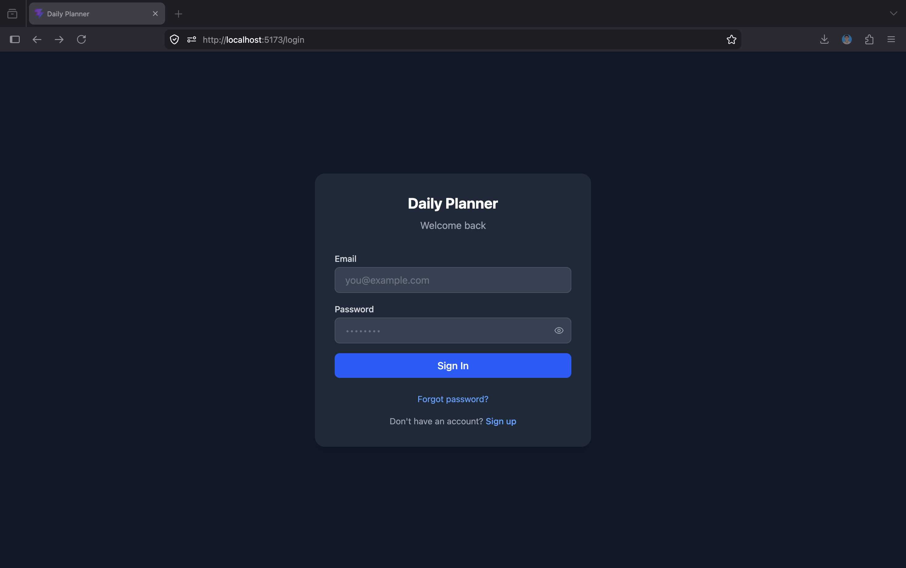
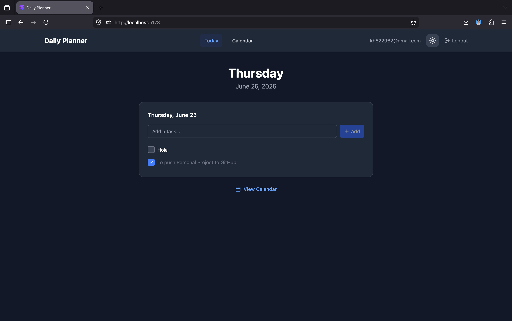
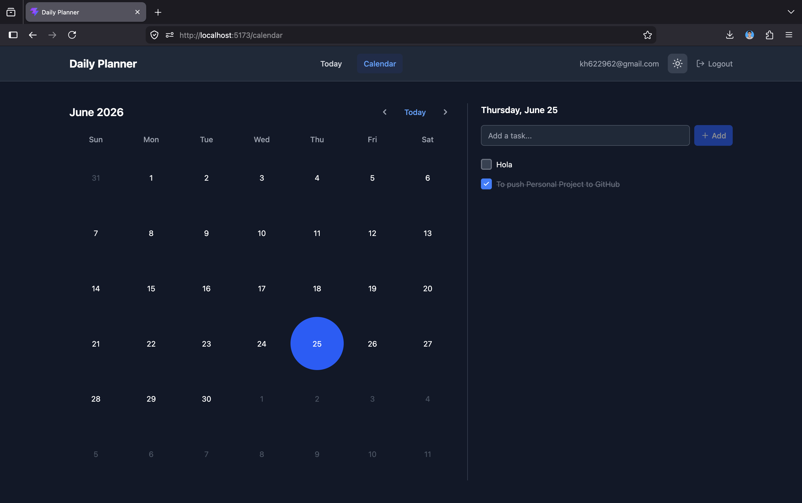

# Daily Planner

A personal productivity app built with Vue 3 and Firebase. Plan your day, manage tasks by date, and track progress across a calendar view. Built as part of the Vibe Code Tour Chapter 3 personal project.

## Preview





## Features

- Email/password authentication
- Add, complete, edit, and delete tasks per day
- Calendar view to browse tasks by date
- Dark/light mode toggle
- Persistent data per user via Firestore

## Tech Stack

| Layer     | Technology                                 |
| --------- | ------------------------------------------ |
| Framework | Vue 3 (Composition API + `<script setup>`) |
| Language  | TypeScript                                 |
| Styling   | Tailwind CSS v4                            |
| Icons     | Lucide Vue                                 |
| Router    | Vue Router v5                              |
| Backend   | Firebase (Auth, Firestore, Hosting)        |
| Build     | Vite                                       |
| Testing   | Vitest + Vue Test Utils                    |

## Project Structure

```
src/
├── components/
│   ├── AppShell.vue          # Layout wrapper with nav
│   ├── CalendarGrid.vue      # Monthly calendar
│   ├── DayCell.vue           # Single day in calendar
│   ├── NotificationPrompt.vue
│   ├── ThemeToggle.vue
│   ├── TodoItem.vue          # Single task row
│   └── TodoPanel.vue         # Task list + add input
├── views/
│   ├── LoginView.vue
│   ├── TodayView.vue         # Today's tasks
│   ├── CalendarView.vue      # Calendar + selected day tasks
│   └── DashboardView.vue
├── composables/
│   ├── useAuth.ts            # Firebase Auth state
│   ├── useTodos.ts           # Firestore CRUD + real-time sync
│   └── useNotifications.ts
├── router/index.ts
└── firebase.ts
```

## Getting Started

```bash
# Install dependencies
npm install

# Set up environment variables
cp .env.example .env
# Fill in your Firebase project credentials in .env

# Start dev server
npm run dev

# Run tests
npm test

# Deploy
npm run build && firebase deploy --only hosting
firebase deploy --only firestore:rules
```

### Required Environment Variables

```
VITE_FIREBASE_API_KEY=
VITE_FIREBASE_AUTH_DOMAIN=
VITE_FIREBASE_PROJECT_ID=
VITE_FIREBASE_STORAGE_BUCKET=
VITE_FIREBASE_MESSAGING_SENDER_ID=
VITE_FIREBASE_APP_ID=
```

## Claude Code Setup

This project uses Claude Code with custom configuration for AI-assisted development.

### MCP Servers (`.mcp.json`)

| Server                                    | Purpose                                  |
| ----------------------------------------- | ---------------------------------------- |
| `@modelcontextprotocol/server-filesystem` | Read/write project files directly        |
| `@modelcontextprotocol/server-memory`     | Persist context across Claude sessions   |
| `@upstash/context7-mcp`                   | Fetch live docs for libraries/frameworks |

### Skills (`.claude/skills/`)

| Skill          | Trigger                                            | What it does                                                                                                                                                         |
| -------------- | -------------------------------------------------- | -------------------------------------------------------------------------------------------------------------------------------------------------------------------- |
| `context7-mcp` | Asking about libraries, frameworks, API references | Fetches current documentation via Context7 for Vue, Firebase, Tailwind, etc. instead of relying on training data. Uses `resolve-library-id` → `query-docs` workflow. |

### Custom Slash Commands (`.claude/commands/`)

| Command                   | Description                                                                                                 |
| ------------------------- | ----------------------------------------------------------------------------------------------------------- |
| `/plan-day`               | Suggests a prioritized schedule for today's tasks                                                           |
| `/add-task <description>` | Parse natural language task input and guide adding it to the app                                            |
| `/design [area]`          | Frontend design audit — checks consistency, responsiveness, dark mode, accessibility, and applies top fixes |

### Sub-Agent (`.claude/agents/`)

| Agent                | Trigger                                                                    | What it does                                                                                                                                     |
| -------------------- | -------------------------------------------------------------------------- | ------------------------------------------------------------------------------------------------------------------------------------------------ |
| `productivity-coach` | "how can I improve the app", "what features should I add", "review the UX" | Reviews components and composables for UX gaps, bugs, and productivity improvements. Outputs severity-tagged findings with file:line references. |

## Firestore Data Model

```
users/
  {userId}/
    todos/
      {todoId}
        text: string
        completed: boolean
        date: string (YYYY-MM-DD)
        createdAt: timestamp
        updatedAt: timestamp
```

Security rules: each user can only read/write their own data (`/users/{userId}/**`).
